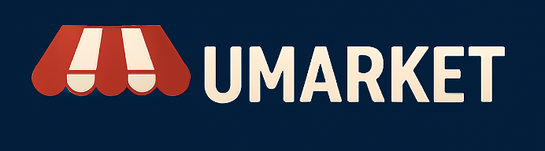

<div align="center">
  
</div>

# U-Market - Proyecto CC5003

Este proyecto corresponde al desarrollo de la plataforma U-Market, una aplicación web para comprar y vender productos dentro de la Facultad de Ciencias Físicas y Matemáticas de la Universidad de Chile (FCFM). 

Este proyecto tiene un desarrollo [backend](backend/README.md) y [frontend](frontend/README.md), y considera un avance por hitos que se detallan a continuación.

---

### Backend
Se implementa una API REST con express + mongoDB. Esta API, responde a consultas de autorización y de información de productos y usuarios.

### Frontend
Se implementa las vistas de Inicio de sesión y Registro de usuario. Solo un usuario con sesión iniciada puede realizar una venta.

## 🛠️ Stack

- [![ReactRouter][react-router-badge]][react-router-url] - A user‑obsessed, standards‑focused, multi‑strategy router you can deploy anywhere.
- [![Typescript][typescript-badge]][typescript-url] - JavaScript with syntax for types.
- [![Tailwind CSS][tailwind-badge]][tailwind-url] - Rapidly build modern websites without ever leaving your HTML.
- [![ExpressJS][Express.js-badge]][express-url] - Fast, unopinionated, minimalist web framework for Node.js.
- [![MongoDB][MongoDB-badge]][mongodb-url] - The database for dynamic, demanding software.

[react-router-url]: https://reactrouter.com/
[typescript-url]: https://www.typescriptlang.org/
[tailwind-url]: https://tailwindcss.com/
[mongodb-url]: https://www.mongodb.com/
[express-url]: https://expressjs.com/

[react-router-badge]: https://img.shields.io/badge/React_Router-CA4245?style=for-the-badge&logo=reactrouter&logoColor=white
[typescript-badge]: https://img.shields.io/badge/Typescript-007ACC?style=for-the-badge&logo=typescript&logoColor=white&color=blue
[tailwind-badge]: https://img.shields.io/badge/Tailwind-ffffff?style=for-the-badge&logo=tailwindcss&logoColor=38bdf8

[MongoDB-badge]: https://img.shields.io/badge/MongoDB-%234ea94b.svg?style=for-the-badge&logo=mongodb&logoColor=white

[Express.js-badge]: https://img.shields.io/badge/express.js-%23404d59.svg?style=for-the-badge&logo=express&logoColor=%2361DAFB

## Mapa de rutas y autenticación
El proyecto cuenta con las siguientes rutas principales:
- `/`: Página principal - muestra los productos disponibles.
- `/login`: Página de inicio de sesión.
- `/register`: Página de registro de usuario.
- `/new/*`: Página para publicar un nuevo producto (requiere autenticación).
- `/product/:id`: Página de detalles del producto.

Para manejar la autenticación, se utiliza JWT (JSON Web Tokens) para asegurar que solo los usuarios autenticados puedan acceder a ciertas rutas, como la publicación de nuevos productos, y el flujo es como sigue:
1. El usuario se registra o inicia sesión a través de las rutas `/register` o `/login`.
2. El servidor valida las credenciales y, si son correctas, genera un token JWT.
3. El token se envía al cliente y se almacena como una cookie segura.
4. Para acceder a rutas protegidas, el cliente envía el token en las solicitudes al servidor.
5. Si el usuario no está autenticado, se le redirige a la página de inicio de sesión.

## Estado Global
### 1. Usuarios
Para el manejo de la sesión se utilizó redux toolkit, se define el `store/store.ts`, luego en `store/auth/authSlice.ts` se definen las acciones y estados.
En el archivo thunks se definen todas aquellas acciones asíncronas que llaman a los servicios. Se tiene checkingAuth para restaurar la sesión, startLogin que llama al inicio de la sesión y startLogout que cierra la misma.

### 2. Carrito de compras
Uno de los estados globales utilizados es del carro de compras. Este es implementado utilizando zustand, definido en `store/cart.ts` en este archivo se definen las variables: 
- cart: representa el el objeto carrito de compras.
- showCart: flag utilizada para saber cuando mostrar el componente del carrito.
- changeDisplayCart: función que cambia el valor de showCart.
- addToCart: función que agrega un objeto al carrito si es que no está en cart y aumenta en uno la cantidad del producto si es que está en el carrito.
- decrementFromCart: función que disminuye la cantidad de un producto en el carrito, si solo tenía una unidad, lo remueve de cart.
- removeFromCart: función que remueve el producto del carrito de compra.
### 3. Checkout
Asociado al carrito, hay un estado global para manejar la lógica de finalización de compra, también se utiliza zustand y en `store/checkout.ts` se definen las variables:
- isPaid: flag que indica si ya se realizó el pago.
- showModal: flag que maneja cuando se muestra el modal de checkout.
- products: lista de productos a considerar en el pago.
- openModal y closeModal: funciones que se encargan de mostrar y ocultar el modal.
- addToProducts: función que agrega productos a la variable products (ya que se puede comprar directamente un producto o desde el carrito de compras).
- toggleIsPaid: función para modificar el valor de isPaid.
- 
## Pruebas End-to-End (E2E) - Playwright
El proyecto incluye pruebas End-to-End (E2E) utilizando Playwright para asegurar que las funcionalidades principales de la aplicación funcionen correctamente. Las pruebas se encuentran en la carpeta `e2e-tests` y cubren los siguientes escenarios:
### 1. Login + acceso a ruta protegida
La prueba verifica:

- que el usuario puede iniciar sesión,
- que se genera el token de sesión (cookie o localStorage),
- que se puede acceder a la ruta protegida `/new/...`,
- que el sistema redirige a `/login` si no hay sesión activa.

### 2. Productos
El flujo mínimo cubierto incluye:

- Crear un nuevo producto.
- Listarlo en la página principal.
- Utilizar el boton de compra.

### 3. Carrito de compras
Los flujos testeados asociado al carrito son:
- Inicialmente está vacío.
- Se agrega un producto al carrito desde la vista principal de productos.
- Se aumenta la cantidad de un producto en particular en el carrito.
- Se disminuye la cantidad de un producto en particular en el carrito, si tiene solo una unidad se remueve el producto del carrito.
- Se vacía el carrito al clickear limpiar carrito.
- Al finalizar la compra:
  - Si se cancela la compra el carrito se mantiene.
  - Si se finaliza la compra, se muestra mensaje de finalización y se limpia el carrito.
  

Y se pueden ejecutar las pruebas con el siguiente comando:
```bash
npm test 
```

## Deploy en el servidor del curso
El despliegue de la aplicación se utilizó el puerto 7156 del servidor fullstack.dcc.uchile.cl.
Primero debemos conectarnos al servidor mediante ssh:
```bash
ssh -p 219 fullstack@fullstack.dcc.uchile.cl
```
Luego, dentro del servidor, se debe navegar a la carpeta donde subir los archivos del proyecto:
```bash
cd ~/umarket/
```
Después, se debe subir el backend al servidor:
```bash
scp -P 219 -r backend fullstack@fullstack.dcc.uchile.cl:umarket/
```
En umarket/backend, se debe crear un archivo `.env` con las variables de entorno necesarias:
```bash
PORT=7156
MONGODB_URI=mongodb://127.0.0.1:27017/
MONGODB_DBNAME=umarket
```
En la carpeta del backend, se deben instalar las dependencias y correr el servidor:
```bash
cd backend
npm install
npm run build
npm run start
```
Finalmente, se puede acceder a la aplicación desde el navegador con la URL de la siguiente sección.
## URL de la aplicación

http://fullstack.dcc.uchile.cl:7156

